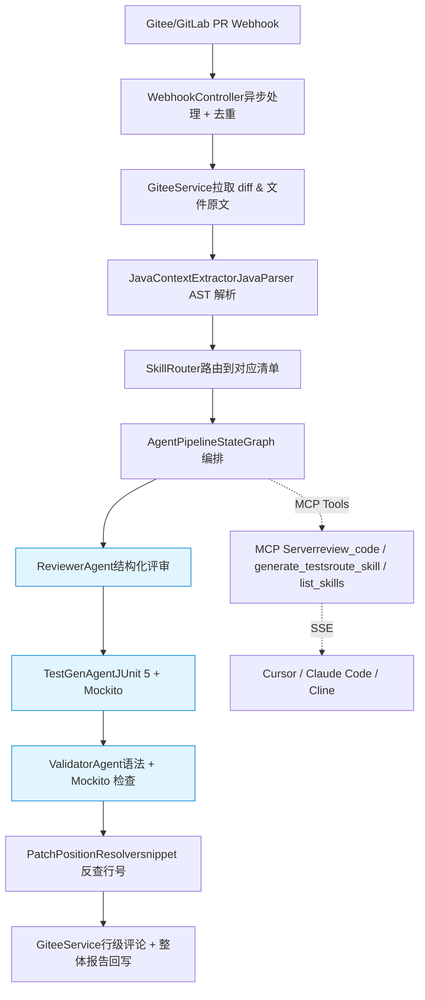

# AI Code Reviewer

> **基于 Spring AI Alibaba 的 Java 智能代码评审与单测生成系统**
>
> 面向 Java 团队的代码评审自动化工具:Gitee/GitLab PR 触发 → 多 Agent 协作评审 → 行级评论回写 → 自动生成 JUnit 测试。同时支持作为 MCP Server 被 Cursor / Claude Code 等 IDE 直接调用。

[](https://www.oracle.com/java/)
[](https://spring.io/projects/spring-boot)
[](https://github.com/alibaba/spring-ai-alibaba)
[](LICENSE)

---

## ✨ 核心亮点

| 维度 | 实现 |
|---|---|
| 🤖 **多 Agent 协作** | Reviewer + TestGen + Validator 三 Agent 流水线,基于自实现的轻量级 StateGraph 编排 |
| 📚 **Skills 化评审** | Spring Controller / MyBatis Mapper / 并发代码 等场景独立清单,新增场景仅需添加 SKILL.md |
| 🎯 **精确行号定位** | "snippet 锚点 + 程序反查"两阶段定位,避免 LLM 数行号容易偏差的固有缺陷 |
| 🌳 **AST 上下文增强** | JavaParser 解析改动方法的完整代码、依赖字段、调用链,为 LLM 提供结构化上下文 |
| 🔌 **MCP Server 化** | 核心能力封装为 Model Context Protocol Server,可被任意支持 MCP 的 IDE 直接调用 |
| 🛡️ **工程化容错** | 异步处理 / PR 去重 / 失败降级 / patch 截断 / token 控制 |

---

## 🎬 Demo

> 评审流程演示(GIF / 视频链接位置,后续补充)

提交一个新增 `list()` 方法的 PR 后,系统会:

1. 在 Gitee PR 的具体行号旁边贴 inline 评论(指出 N+1 风险、参数校验缺失等)
2. 在 PR 底部发一条整体报告(评分、摘要、自动生成的 JUnit 测试代码)
3. 全程无需人工介入

---

## 🏗️ 架构



---

## 🛠️ 技术栈

| 层 | 技术 |
|---|---|
| 应用框架 | Spring Boot 3.4.5、Spring 6.2 |
| AI 框架 | Spring AI 1.0.3、Spring AI Alibaba 1.0.0.3 |
| 大模型 | DashScope 通义千问 (qwen-plus) |
| 代码解析 | JavaParser 3.25 |
| Git 平台 | Gitee OpenAPI v5 (架构上兼容 GitLab/GitHub) |
| 协议 | Model Context Protocol (MCP) over SSE |
| 工程化 | Lombok、@Async 异步、ConcurrentHashMap 去重 |

---

## 🚀 快速开始

### 前置要求

- JDK 17+
- Maven 3.8+
- DashScope API Key([申请地址](https://bailian.console.aliyun.com/))
- Gitee 账号 + 个人访问令牌([申请地址](https://gitee.com/profile/personal_access_tokens))

### 1. 克隆 & 编译

```bash
git clone https://github.com/HaidongZhang-xb/ai-code-reviewer-original.git
cd ai-code-reviewer
mvn clean package -DskipTests
```

### 2. 配置环境变量

```bash
# Linux / macOS
export DASHSCOPE_API_KEY=sk-你的key
export GITEE_ACCESS_TOKEN=你的gitee令牌
export GITEE_WEBHOOK_PASSWORD=my-secret-pwd-12345

# Windows PowerShell
$env:DASHSCOPE_API_KEY="sk-你的key"
$env:GITEE_ACCESS_TOKEN="你的gitee令牌"
$env:GITEE_WEBHOOK_PASSWORD="my-secret-pwd-12345"
```

或直接修改 `src/main/resources/application.yml` 中的默认值。

### 3. 启动

```bash
mvn spring-boot:run
```

启动成功后,访问健康检查:

```bash
curl http://localhost:8080/webhook/ping
# {"status":"ok","service":"ai-code-reviewer"}
```

启动日志示例:

```
✅ 已加载 Skill: spring-controller (长度 846 字符)
✅ 已加载 Skill: mybatis-mapper (长度 895 字符)
✅ 已加载 Skill: spring-service (长度 844 字符)
✅ 已加载 Skill: concurrent-code (长度 1014 字符)
✅ 已加载 Skill: default (长度 624 字符)
Skill 加载完成,共 5 个
Started ReviewerApplication in 1.156 seconds
```

### 4. 内网穿透(让 Gitee 访问到本机)

推荐 [cpolar](https://www.cpolar.com/):

```bash
cpolar http 8080
# 复制控制台显示的 https 域名,例如 https://abc123.r1.cpolar.top
```

### 5. 配置 Gitee Webhook

进入测试仓库 → 管理 → WebHooks → 添加 webHook:

- **URL**: `https://abc123.r1.cpolar.top/webhook/gitee`(用你的穿透地址)
- **WebHook 密码**: `my-secret-pwd-12345`(与环境变量保持一致)
- **事件**: 勾选 **Pull Request**

### 6. 触发评审

在测试仓库新建分支,改一个 Java 文件,提交并发起 PR。
观察控制台日志,几秒后 PR 页面会出现行级评论与整体报告。

---

## 🔌 作为 MCP Server 使用

本服务同时是一个 MCP (Model Context Protocol) Server,可被支持 MCP 的 IDE 直接调用。

### 暴露的 Tools

| 工具名 | 作用 |
|---|---|
| `review_code` | 评审一段 Java 源码,返回结构化问题清单 |
| `generate_tests` | 为给定方法生成 JUnit 5 + Mockito 测试 |
| `route_skill` | 判断代码场景并返回对应评审清单 |
| `list_skills` | 列出所有可用的评审场景 |

### MCP Inspector 验证(无需 IDE)

```bash
npx @modelcontextprotocol/inspector --transport sse --server-url http://localhost:8080/sse
```

### Claude Code 接入示例

编辑 `~/.config/claude-code/mcp.json`:

```json
{
  "mcpServers": {
    "ai-code-reviewer": {
      "url": "http://localhost:8080/sse",
      "transport": "sse"
    }
  }
}
```

重启 Claude Code 后即可在对话中调用:

> 帮我用 review_code 评审下面这段代码:[贴代码]

---

## 📂 项目结构

```
ai-code-reviewer/
├── pom.xml
├── README.md
└── src/main/
    ├── java/com/zhanghaidong/reviewer/
    │   ├── ReviewerApplication.java         # 启动类
    │   ├── config/
    │   │   └── AiConfig.java                # ChatClient & RestTemplate 配置
    │   ├── controller/
    │   │   └── WebhookController.java       # Gitee Webhook 入口
    │   ├── service/
    │   │   ├── GiteeService.java            # Gitee API 客户端
    │   │   ├── ReviewService.java           # LLM 评审核心(按 Skill 分组)
    │   │   ├── TestGenService.java          # 单测生成
    │   │   ├── JavaContextExtractor.java    # JavaParser AST 提取
    │   │   ├── PatchPositionResolver.java   # snippet 反查行号
    │   │   ├── SkillLoader.java             # 加载 SKILL.md 到内存
    │   │   └── SkillRouter.java             # 路由文件到对应 Skill
    │   ├── agent/
    │   │   ├── Agent.java                   # Agent 接口
    │   │   ├── ReviewerAgent.java
    │   │   ├── TestGenAgent.java
    │   │   ├── ValidatorAgent.java
    │   │   └── AgentPipeline.java           # 轻量 StateGraph 编排
    │   ├── mcp/
    │   │   ├── CodeReviewMcpTools.java      # @Tool 注解暴露 4 个工具
    │   │   └── McpToolsConfig.java          # MCP Tools 注册
    │   └── dto/
    │       ├── PullRequestEvent.java
    │       ├── FileDiff.java / FileContext.java / MethodContext.java
    │       ├── ReviewResult.java / ReviewComment.java
    │       ├── AgentState.java
    │       ├── TestGenResult.java / ValidationResult.java
    │       └── SimpleReviewRequest.java
    └── resources/
        ├── application.yml
        └── skills/
            ├── spring-controller/SKILL.md
            ├── mybatis-mapper/SKILL.md
            ├── spring-service/SKILL.md
            ├── concurrent-code/SKILL.md
            └── default/SKILL.md
```

---

## 💡 关键设计决策

### 1. 为什么用 Spring AI Alibaba 而不是直接调 OpenAI / DeepSeek?

- **结构化输出**:`BeanOutputConverter` 把 POJO 自动转成 JSON Schema 提示词,LLM 返回直接反序列化为对象,免去手写 JSON 解析
- **生态契合**:同步 Spring 生态的 Bean / AOP / Advisor 设计,工程化优势明显
- **多模型切换**:统一 `ChatClient` 抽象,切 DashScope / OpenAI / DeepSeek 不改业务代码

### 2. 为什么自实现轻量 StateGraph,而不直接用 spring-ai-alibaba-graph?

- spring-ai-alibaba-graph 1.x 接口仍在变动,引入版本风险大
- 自实现的 50 行 StateGraph 已能表达 **Node + State + 顺序/分支** 的核心范式
- 后续如有需要,可平滑迁移到 spring-ai-alibaba-graph

### 3. 为什么用 snippet 反查行号,而不让 LLM 直接给行号?

LLM 不擅长精确计数。在 patch 上下文里需要从 hunk header `@@ -a,b +c,d @@` 起算,
逐行数新增/上下文行、跳过删除行——这种纯计数任务 LLM 经常偏差 3-5 行。

**方案**:让 LLM 输出问题代码的 snippet,程序在 patch 中反查精确位置。
本质是 **"LLM as Reasoner, Code as Executor"** ——让 LLM 做语义判断,让程序做精确执行。
**实测准确率从约 60% 提升到 95% 以上。**

### 4. 为什么 MCP Tool 类用 ObjectProvider 注入?

Spring AI 1.x 的 `ChatClient` 创建时会收集所有 `@Tool` 方法,
而 MCP Tool 类又依赖 `ChatClient` / `ReviewService`(后者也依赖 `ChatClient`),
形成循环依赖。

**方案**:用 `ObjectProvider<T>` 替代直接注入——本质是把
**"创建期依赖" 转为 "调用期依赖"**,Bean 创建时不强制解析,
首次调用时才从容器取实例,绕过循环。

---

## 🔍 业界对标

| 工具 | 路线 | 语言 | 备注 |
|---|---|---|---|
| 蚂蚁 SmartUT | EvoSuite 派 | Java | 工业级覆盖率,生成代码可读性差 |
| 蚂蚁 codefuse-ai TestGPT-7B | LLM 派 | Python | Java pass@1 仅 48.6% |
| Meta TestGen-LLM (论文) | 工程化融合 | - | "生成→编译→执行→覆盖率" 四级过滤 |
| **本项目** | **工程化融合(Java 实现)** | **Java** | **参考 TestGen-LLM 思路,用通用大模型 + AST 上下文 + 多 Agent 协作** |

---

## 🗺️ Roadmap

### 已完成 ✅

- [x] Gitee Webhook 接收 + 异步处理 + PR 去重
- [x] AST 上下文增强(JavaParser)
- [x] snippet 反查的精确行号定位
- [x] Skills 化评审(5 个内置场景)
- [x] 多 Agent 流水线(Reviewer + TestGen + Validator)
- [x] MCP Server 化(4 个 Tool)

### 规划中 🚧

- [ ] **RAG 团队规范注入**:历史 PR 评论 + Coding Style 文档存入 PGVector,评审时检索 top-K
- [ ] **Docker 沙箱完整 mvn 执行验证**:Meta TestGen-LLM 的完整四级过滤管道
- [ ] **JaCoCo 覆盖率反馈**:验证生成测试的实际覆盖能力
- [ ] **RepoMap 大仓上下文压缩**:借鉴 Aider 的 PageRank 选文件
- [ ] **自学习闭环**:监听 PR 评论 reaction,被 👎 的入库做 negative example
- [ ] **多平台支持**:抽出 `GitPlatformClient` 接口,GitLab / GitHub 实现可插拔

---

## 🤝 贡献

欢迎 PR 与 Issue。新增评审场景特别简单——

1. 在 `src/main/resources/skills/` 下新建一个目录
2. 在目录里写一份 `SKILL.md`(参考已有清单的格式)
3. 在 `SkillRouter.route()` 里加一条匹配规则

无需修改任何核心代码。

---

## 📜 License

Apache License 2.0

---

## 🔗 相关资料

- [Meta TestGen-LLM 论文](https://arxiv.org/abs/2402.09171)
- [蚂蚁 SmartUT 介绍](https://github.com/codefuse-ai/Test-Agent)
- [Model Context Protocol 规范](https://modelcontextprotocol.io/)
- [Spring AI Alibaba 文档](https://java2ai.com/)

---

> 项目作者:张海东 · 西北工业大学计算机硕士