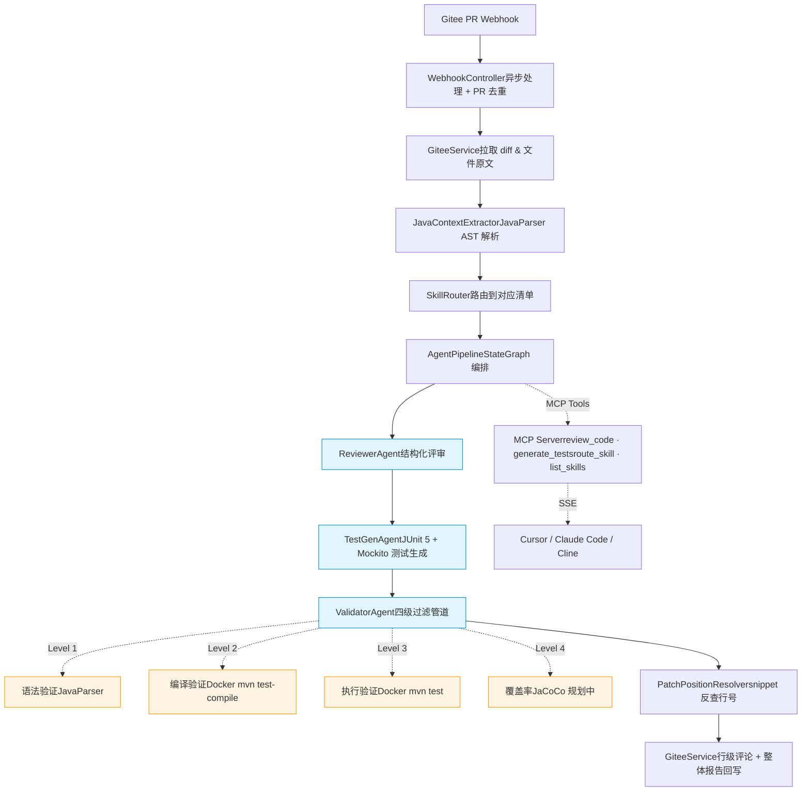

<div align="center">

# 🤖 AI Code Reviewer

**基于 Spring AI Alibaba 的 Java 智能代码评审与单测生成系统**

面向 Java 团队的代码评审自动化工具:
PR 触发 → 多 Agent 协作评审 → 行级评论回写 → 自动生成 JUnit 测试 → Docker 沙箱执行验证

[](https://www.oracle.com/java/)
[](https://spring.io/projects/spring-boot)
[](https://github.com/alibaba/spring-ai-alibaba)
[](https://modelcontextprotocol.io/)
[](LICENSE)

</div>

---

## ✨ 核心亮点

| 维度 | 实现 |
|---|---|
| 🤖 **多 Agent 协作** | Reviewer + TestGen + Validator 三 Agent 流水线,基于自实现的轻量级 StateGraph 编排 |
| 🐳 **四级测试过滤管道** | 完整复刻 Meta TestGen-LLM 论文方案:语法 → Docker 编译 → Docker 执行 → 覆盖率(规划中) |
| 📚 **Skills 化评审** | Spring Controller / MyBatis Mapper / 并发代码 等场景独立清单,新增场景仅需添加 `SKILL.md` |
| 🎯 **精确行号定位** | "snippet 锚点 + 程序反查"两阶段定位,把 LLM 数行号偏差从 ~40% 降到 <5% |
| 🌳 **AST 上下文增强** | JavaParser 解析改动方法的完整代码、依赖字段、调用链,为 LLM 提供结构化上下文 |
| 🔌 **MCP Server 化** | 核心能力封装为 Model Context Protocol Server,可被 Cursor / Claude Code / Cline 等 IDE 直接调用 |

---

## 🎬 Demo

> Demo 视频: [B 站链接占位] / [YouTube 链接占位]

**典型流程**:

1. 研发提交 PR 到 Gitee 仓库
2. Webhook 触发本服务,几秒内完成评审
3. PR 页面出现:
    - 多条**行级评论**(精确指向问题代码所在行)
    - 一条**整体报告**(总分 + 摘要 + 自动生成的 JUnit 测试)
4. 全程无需人工介入,reviewer 只需复核 AI 评论质量

---

## 🏗️ 架构



---

## 🛠️ 技术栈

| 层 | 技术 |
|---|---|
| 应用框架 | Spring Boot 3.4.5 · Spring 6.2 |
| AI 框架 | Spring AI 1.0.3 · Spring AI Alibaba 1.0.0.3 |
| 大模型 | DashScope 通义千问 (qwen-plus) |
| 代码解析 | JavaParser 3.25 |
| 沙箱执行 | Docker · Maven 3.9 · Apache Commons Exec |
| Git 平台 | Gitee OpenAPI v5(架构上兼容 GitLab/GitHub) |
| 协议 | Model Context Protocol over SSE |
| 工程化 | Lombok · @Async 异步 · ConcurrentHashMap PR 去重 |

---

## 🚀 快速开始

### 前置要求

- JDK 17+
- Maven 3.8+
- Docker Desktop(可选,用于 Level 2/3 沙箱验证;不装也能用,会自动降级到 Level 1)
- DashScope API Key([申请](https://bailian.console.aliyun.com/))
- Gitee 账号 + 个人访问令牌([申请](https://gitee.com/profile/personal_access_tokens))

### 1. 克隆 & 编译

```bash
git clone https://github.com/HaidongZhang-xb/ai-code-reviewer-original.git
cd ai-code-reviewer
mvn clean package -DskipTests
```

### 2. 配置环境变量

```bash
# Linux / macOS
export DASHSCOPE_API_KEY=sk-你的key
export GITEE_ACCESS_TOKEN=你的gitee令牌
export GITEE_WEBHOOK_PASSWORD=my-secret-pwd-12345

# Windows PowerShell
$env:DASHSCOPE_API_KEY="sk-你的key"
$env:GITEE_ACCESS_TOKEN="你的gitee令牌"
$env:GITEE_WEBHOOK_PASSWORD="my-secret-pwd-12345"
```

### 3. 准备 Docker 沙箱(可选)

```bash
docker pull maven:3.9-eclipse-temurin-17
```

未装 Docker 时,在 `application.yml` 设 `sandbox.enabled: false`,系统会自动降级到 Level 1 语法验证。

### 4. 启动

```bash
mvn spring-boot:run
```

启动日志示例:

```
✅ 已加载 Skill: spring-controller (长度 846 字符)
✅ 已加载 Skill: mybatis-mapper (长度 895 字符)
✅ 已加载 Skill: spring-service (长度 844 字符)
✅ 已加载 Skill: concurrent-code (长度 1014 字符)
✅ 已加载 Skill: default (长度 624 字符)
🐳 Docker 沙箱已就绪: image=maven:3.9-eclipse-temurin-17, timeout=120s
Started ReviewerApplication in 1.x seconds
```

健康检查:

```bash
curl http://localhost:8080/webhook/ping
# {"status":"ok","service":"ai-code-reviewer"}
```

### 5. 内网穿透 + Webhook 配置

推荐 [cpolar](https://www.cpolar.com/):

```bash
cpolar http 8080
```

进入 Gitee 仓库 → 管理 → WebHooks → 添加:

- **URL**: `https://your-cpolar-domain.cpolar.top/webhook/gitee`
- **WebHook 密码**: 与环境变量 `GITEE_WEBHOOK_PASSWORD` 保持一致
- **事件**: 勾选 **Pull Request**

发起一个 PR,几秒后 PR 页面会出现行级评论与整体报告。

---

## 🔌 作为 MCP Server 使用

本服务同时是一个 MCP (Model Context Protocol) Server,可被支持 MCP 的 IDE 直接调用。

### 暴露的 Tools

| 工具 | 作用 |
|---|---|
| `review_code` | 评审一段 Java 源码,返回结构化问题清单 |
| `generate_tests` | 为给定方法生成 JUnit 5 + Mockito 测试 |
| `route_skill` | 判断代码场景并返回对应评审清单 |
| `list_skills` | 列出所有可用评审场景 |

### 用 mcp-inspector 验证(无需 IDE)

```bash
npx @modelcontextprotocol/inspector \
  --transport sse \
  --server-url http://localhost:8080/sse
```

### Claude Code 接入

编辑 `~/.config/claude-code/mcp.json`:

```json
{
  "mcpServers": {
    "ai-code-reviewer": {
      "url": "http://localhost:8080/sse",
      "transport": "sse"
    }
  }
}
```

---

## 📂 项目结构

```
ai-code-reviewer/
├── pom.xml
├── README.md
└── src/main/
    ├── java/com/zhanghaidong/reviewer/
    │   ├── ReviewerApplication.java
    │   ├── config/AiConfig.java
    │   ├── controller/WebhookController.java       # Webhook 入口
    │   ├── service/
    │   │   ├── GiteeService.java                   # Gitee API 客户端
    │   │   ├── ReviewService.java                  # LLM 评审核心(按 Skill 分组)
    │   │   ├── TestGenService.java
    │   │   ├── DockerSandboxService.java           # Docker 沙箱执行
    │   │   ├── JavaContextExtractor.java           # JavaParser AST 提取
    │   │   ├── PatchPositionResolver.java          # snippet 反查行号
    │   │   ├── SkillLoader.java
    │   │   └── SkillRouter.java
    │   ├── agent/
    │   │   ├── Agent.java                          # Agent 接口
    │   │   ├── ReviewerAgent.java
    │   │   ├── TestGenAgent.java
    │   │   ├── ValidatorAgent.java                 # 四级过滤管道
    │   │   └── AgentPipeline.java                  # StateGraph 编排
    │   ├── mcp/
    │   │   ├── CodeReviewMcpTools.java             # 4 个 @Tool 注解方法
    │   │   └── McpToolsConfig.java
    │   └── dto/                                    # 各种数据传输对象
    └── resources/
        ├── application.yml
        ├── sandbox/template/pom.xml                # 沙箱内 Maven 工程骨架
        └── skills/
            ├── spring-controller/SKILL.md
            ├── mybatis-mapper/SKILL.md
            ├── spring-service/SKILL.md
            ├── concurrent-code/SKILL.md
            └── default/SKILL.md
```

---

## 💡 关键设计决策

### 为什么用 Spring AI Alibaba 而不是直接调 OpenAI / DeepSeek?

- **结构化输出**: `BeanOutputConverter` 自动把 POJO 转成 JSON Schema 提示词,LLM 返回直接反序列化为对象
- **生态契合**: 与 Spring Bean / AOP / Advisor 体系无缝整合
- **多模型切换**: 统一 `ChatClient` 抽象,切 DashScope / OpenAI / DeepSeek 不改业务代码

### 为什么自实现轻量 StateGraph 而不直接用 spring-ai-alibaba-graph?

spring-ai-alibaba-graph 当前版本(1.x)接口仍在变动,引入风险大。
自实现的 50 行 StateGraph 已能表达 **Node + State + 条件跳过** 的核心范式,
后续如有需要可平滑迁移。

### 为什么用 snippet 反查行号,而不让 LLM 直接给行号?

LLM 不擅长精确计数。在 patch 上下文里需要从 hunk header `@@ -a,b +c,d @@` 起算,
逐行数新增/上下文/跳过删除——这种纯计数任务 LLM 经常偏差 3-5 行。

**方案**: 让 LLM 输出问题代码的 snippet,程序在 patch 中反查精确位置。
本质是 **"LLM as Reasoner, Code as Executor"**——让 LLM 做语义判断,让程序做精确执行。
**实测准确率从约 60% 提升到 95% 以上。**

### 为什么 MCP Tool 类用 ObjectProvider 注入?

Spring AI 1.x 的 `ChatClient` 创建时会收集所有 `@Tool` 方法所在的 Bean,
而 MCP Tool 类又依赖 `ChatClient` / `ReviewService`(后者也依赖 `ChatClient`),
形成循环。

**方案**: 用 `ObjectProvider<T>` 替代直接注入,把 **"创建期依赖" 转为 "调用期依赖"**,
Bean 创建时不强制解析,首次调用时才取实例,绕过循环。

---

## 🔍 业界对标

| 工具 | 路线 | 语言 | 备注 |
|---|---|---|---|
| 蚂蚁 SmartUT | EvoSuite 派 | Java | 工业级覆盖率,生成代码可读性差 |
| 蚂蚁 codefuse-ai TestGPT-7B | LLM 派 | Python | Java pass@1 仅 48.6% |
| Meta TestGen-LLM (论文) | 工程化融合 | - | "生成→编译→执行→覆盖率" 四级过滤 |
| **本项目** | **工程化融合(Java)** | **Java** | **复刻 TestGen-LLM 思路 · 通用大模型 + AST 上下文 + 多 Agent 协作** |

---

## ⚠️ Known Limitations

本项目作为**学习与求职作品**实现了完整的核心管道,但生产化部署还需补全以下安全增强项。
**以下所有项均已识别但未在本版本实现**——这是有意识的工程取舍:

### 沙箱安全

- [ ] **网络隔离**: 当前未禁网,LLM 生成的恶意测试代码理论上能外发数据。
  生产化方案是**两阶段网络**:首次拉依赖时允许网络,后续禁网(`--network=none`)
- [ ] **非 root 用户**: 当前以 root 运行 mvn,应加 `--user 1000:1000`
- [ ] **只读挂载**: 测试代码目录应 `:ro` 挂载,输出目录用 tmpfs
- [ ] **容器超时强杀**: 当前 watchdog 只杀 docker 客户端,容器可能成孤儿。
  应使用 `--name` + 超时后 `docker kill`

### 工程化

- [ ] **测试代码依赖管理**: 当前沙箱只装了 JUnit + Mockito 基础依赖,
  LLM 生成的测试若 import 被测项目类(如 `com.example.entity.User`),编译会失败。
  生产化方案是挂载用户的 maven local repo 或 git clone 整个项目到容器
- [ ] **测试覆盖率(Level 4)**: JaCoCo 集成尚未实现
- [ ] **分布式去重**: PR 去重缓存目前是单机 ConcurrentHashMap,多实例部署会重复评审。应迁到 Redis
- [ ] **可观测性**: 缺少 Prometheus 指标和分布式追踪
- [ ] **重试与熔断**: LLM 调用失败仅有简单 try-catch,应加 Resilience4j 重试 + 熔断
- [ ] **单测覆盖率**: 自身测试覆盖率较低,核心算法(`PatchPositionResolver`)
  应优先补单元测试

---

## 🗺️ Roadmap

### 已完成 ✅

- [x] Gitee Webhook 接收 + 异步处理 + PR 去重
- [x] AST 上下文增强(JavaParser)
- [x] snippet 反查的精确行号定位
- [x] Skills 化评审(5 个内置场景)
- [x] 多 Agent 流水线(Reviewer + TestGen + Validator)
- [x] **Docker 沙箱执行(Level 1-3)**
- [x] MCP Server 化(4 个 Tool)

### 持续迭代中 🚧

- [ ] **JaCoCo 覆盖率验证(Level 4)**
- [ ] **沙箱安全加固**: 见 Known Limitations
- [ ] **RAG 团队规范注入**: PGVector + DashScope embedding,检索团队历史 PR 评论与 Coding Style
- [ ] **被测项目依赖管理**: 自动挂载或预下载项目依赖,提高沙箱编译通过率
- [ ] **Redis 分布式去重缓存**
- [ ] **多平台支持**: 抽 `GitPlatformClient` 接口, GitLab / GitHub 实现可插拔
- [ ] **自学习闭环**: 监听 PR 评论 reaction(👍/👎),被点踩的入库做 negative example

---

## 🤝 贡献

新增评审场景特别简单——

1. 在 `src/main/resources/skills/` 下新建一个目录
2. 在目录里写一份 `SKILL.md`(参考已有清单的格式)
3. 在 `SkillRouter.route()` 里加一条匹配规则

无需修改任何核心代码。

---

## 📜 License

Apache License 2.0

---

## 🔗 相关资料

- [Meta TestGen-LLM 论文](https://arxiv.org/abs/2402.09171)
- [蚂蚁 codefuse-ai Test-Agent](https://github.com/codefuse-ai/Test-Agent)
- [Model Context Protocol 规范](https://modelcontextprotocol.io/)
- [Spring AI Alibaba 文档](https://java2ai.com/)
- [Anthropic Claude Code Skills](https://www.anthropic.com/news/claude-skills)

---

<div align="center">

**项目作者**: 张海东 · 西北工业大学计算机硕士

</div>